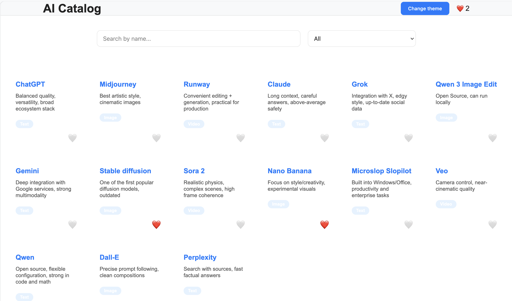
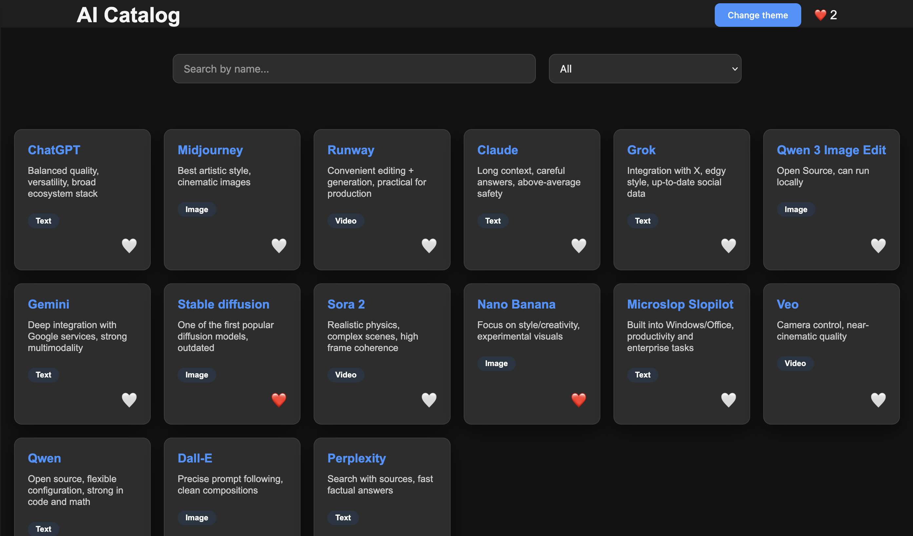

# AI Catalog

## Overview

A client-side web application for browsing and organizing AI tools.  
The project focuses on modular architecture, predictable state management, and fast UI interactions without backend dependencies.

---

## Preview




---

## Live Demo

https://vocal-mermaid-9510a2.netlify.app/

---

## Key Features

- **Search** — client-side search by name and description
- **Filtering** — single-category filtering (All, Video, Image, Text)
- **Favorites** — managed via custom hook (`useFavorites`)
- **Theme** — dark/light mode with persistent user preference (`useTheme`)
- **Responsive UI** — optimized for mobile, tablet, and desktop

---

## Tech Stack

- **React 18** — functional components
- **TypeScript** — strict typing
- **Vite** — fast build tool and dev server
- **CSS Modules** — scoped styling

---

## Architecture

The application follows a modular structure with clear separation of concerns:

- **Components** — reusable UI elements  
- **Hooks** — encapsulated logic (`useFavorites`, `useTheme`)  
- **Consts** — static data and configuration  
- **Utils** — data processing (filtering, search)  
- **Types** — TypeScript interfaces  

All data processing (search and filtering) is performed on the client side.

State management is implemented using `useState`, `useEffect`, and custom hooks.

---

## Project Structure

```

src/
├── components/
├── consts/
├── hooks/
│ ├── useFavorites.ts
│ └── useTheme.ts
├── types/
├── utils/
├── App.tsx
└── main.tsx

```
---

## Getting Started

```bash
git clone https://github.com/vladv255/my_site.git
cd your-project-name
npm install
npm run dev
```

---

## Contact

Telegram: @Sunny_255  
GitHub: https://github.com/vladv255

---